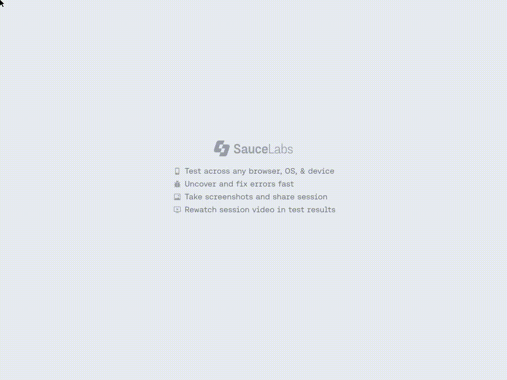
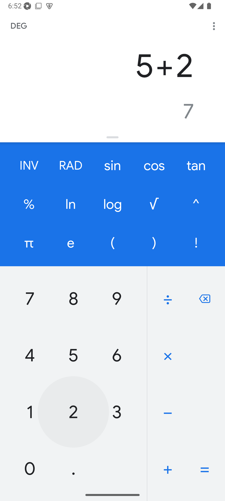
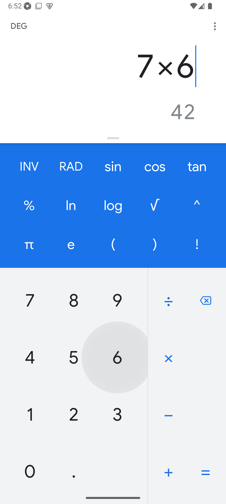
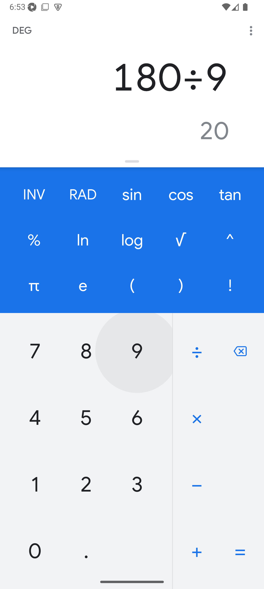
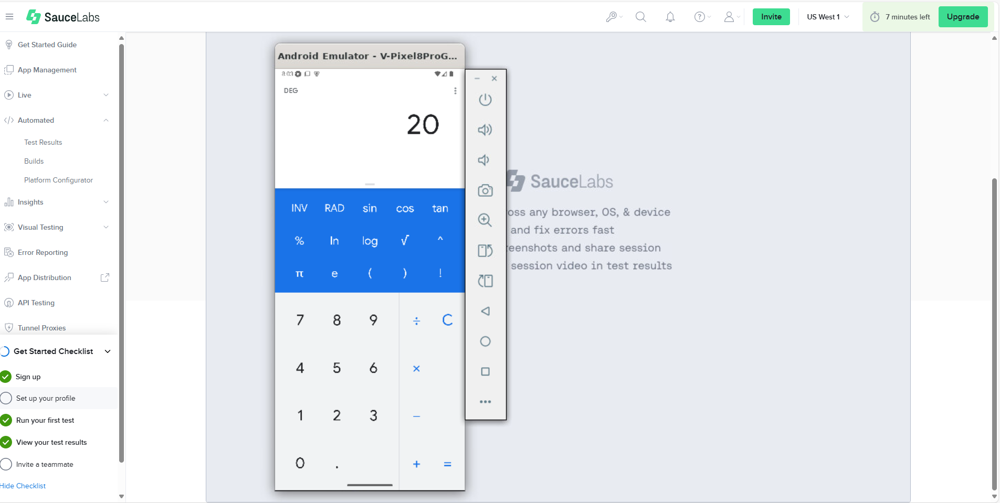

<div  align="center">
	<h1>📱 Mobile Calculator Automation</h1>
</div>

## 🧐 Descrição

Este repositório contém a resolução da atividade de automação mobile utilizando **Appium** com **WebdriverIO** para testar o aplicativo **Calculadora Google** em dispositivos Android virtuais, que faz parte "Formação em Teste de Software" da [Iterasys](https://iterasys.com.br/pt), ministrado pelo professor José Correia.

A automação cobre operações básicas de cálculo (soma, subtração, multiplicação e divisão) com validações assertivas para garantir o comportamento correto do aplicativo.

A configuração contempla execução em emuladores Android 15+ no ambiente [Sauce Labs](https://saucelabs.com/), com boas práticas de estruturação dos testes e uso de seletores estáveis.

## 📊 Baseado no Cenário
Os testes automatizados contemplam as seguintes operações básicas na calculadora:

| Operação | Resultado Esperado |
|----------|--------------------|
| 5 + 2    | 7                  |
| 10 - 4   | 6                  |
| 7 × 6    | 42                 |
| 180 ÷ 9  | 20                 |


## 💻 Tecnologias e Ferramentas Utilizadas

- **IDE:** Visual Studio Code
- **Sistema operacional:** Ubuntu Linux
- **Ferramenta de automação mobile:** Appium
- **Inspeção de elementos:** Appium Inspector
- **Framework de automação:** WebDriverIO
- **Linguagem:** JavaScript (Node.js)
- **Plataforma de testes em nuvem:** Sauce Labs
- **Versão compatível com Android 15+:** Google Calculator APK

## ⚙️ Configuração do Ambiente

### 📋 Pré-requisitos

- Node.js (versão 16+ recomendada).
- Conta ativa no Sauce Labs com credenciais configuradas.
- APK do Google Calculator carregado no Sauce Labs Storage (opcional, se usar app pré-instalado no emulador).
- Emulador Android 15+ configurado no Sauce Labs.

### 🛠️ Instalação

Siga os passos abaixo para configurar o ambiente e executar os testes do projeto:

### 1. Clonar o repositório

Abra o terminal e execute:

```sh
git clone <URL_DO_REPOSITORIO>
```

### 2. Instalar dependências

Certifique-se de ter o Node.js instalado.
Em seguida, instale as dependências do projeto:

```sh
npm install
```

### 3. Configurar credenciais do Sauce Labs via terminal

Antes de rodar os testes, exporte suas credenciais do Sauce Labs no terminal:

No Linux/macOS:

```sh
export SAUCE_USERNAME=seu_usuario
export SAUCE_ACCESS_KEY=sua_access_key
```

No Windows (PowerShell):

```sh
$env:SAUCE_USERNAME="seu_usuario"
$env:SAUCE_ACCESS_KEY="sua_access_key"
```

Essas informações podem ser obtidas no [Painel do Sauce Labs](https://app.saucelabs.com/user-settings).

### 4. Upload do APK no Sauce Labs

Faça o upload do APK da aplicação no painel do Sauce Labs e utilize o nome do arquivo retornado na capability `appium:app`.

> Consulte a [documentação oficial do Sauce Labs](https://docs.saucelabs.com/mobile-apps/automated-testing/app-storage/) para saber como fazer upload do seu app.

### 5. Configurar capabilities (se necessário)

No arquivo `wdio.conf.js`, confira se as capabilities estão configuradas para execução remota no Sauce Labs, por exemplo:

```js
capabilities: [
  {
      'platformName': 'Android',
      'appium:platformVersion': '15.0',
      'appium:deviceName': 'Google Pixel 8 Pro GoogleAPI Emulator',
      'appium:deviceOrientation': 'portrait',
      'appium:app': 'storage:filename=calculator-7-8-271241277.apk',
      'appium:appPackage': 'com.google.android.calculator',
      'appium:appActivity': 'com.android.calculator2.Calculator',
      'appium:automationName': 'UIAutomator2',
      'browserName': '',
  },
],
```

> O valor `storage:filename=...` refere-se ao upload do APK para o armazenamento do Sauce Labs.
> Consulte a [documentação oficial do Sauce Labs](https://docs.saucelabs.com/mobile-apps/automated-testing/app-storage/) para saber como fazer upload do seu app.

## 🧪 Execução dos Testes

Para executar os testes automatizados na nuvem do Sauce Labs, utilize o comando:

```sh
npm run wdio
```

> Certifique-se de que o script `"wdio": "wdio run wdio.conf.js"` está presente em seu `package.json`.  
> Alternativamente, rode diretamente com:
>
> ```
> npx wdio run wdio.conf.js
>
> ```

Os resultados dos testes e vídeos de execução estarão disponíveis no painel do Sauce Labs.

## 📸 Evidências dos Testes

Abaixo, algumas evidências extraídas das execuções no Sauce Labs mostrando testes bem-sucedidos:

### Vídeo de teste bem-sucedido

[Ver vídeo do resultado do teste](docs/videos/calculator_sucess.mp4)

### Gif de teste bem-sucedido

<p align="center">
  
</p>

### Screenshot de teste bem-sucedido

<p align="center">
  
  
  
  
</p>

### SResultado do teste no Sauce Labs

<p align="center">
  
</p>

## 🦸🏻‍♀️ Autor

<div align="center">
  <a href="https://github.com/janascher">
    
    <br />
    <sub>
      <b>Janaína Scher</b> 👩🏻‍💻
    </sub>
    <br />
    <i>Profissional em Teste de Software e Garantia da Qualidade (QA)</i>
  </a>
</div>
